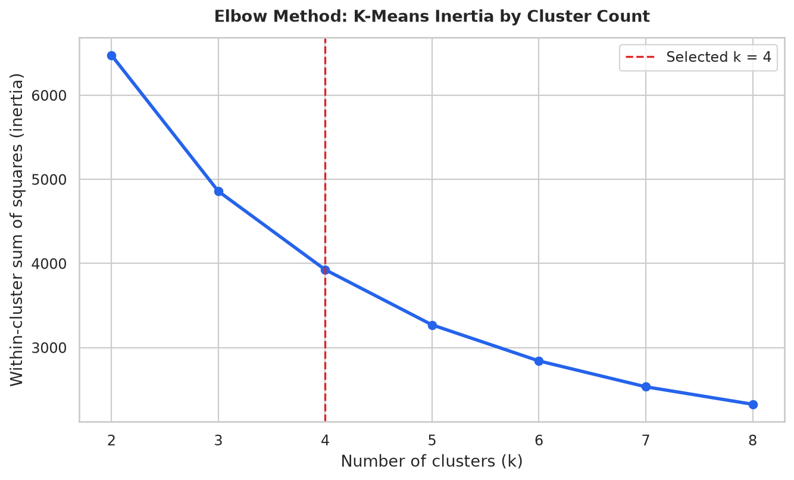
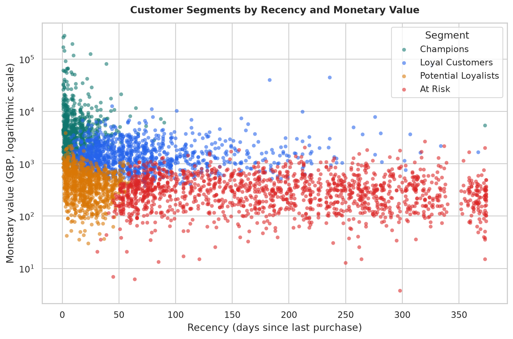
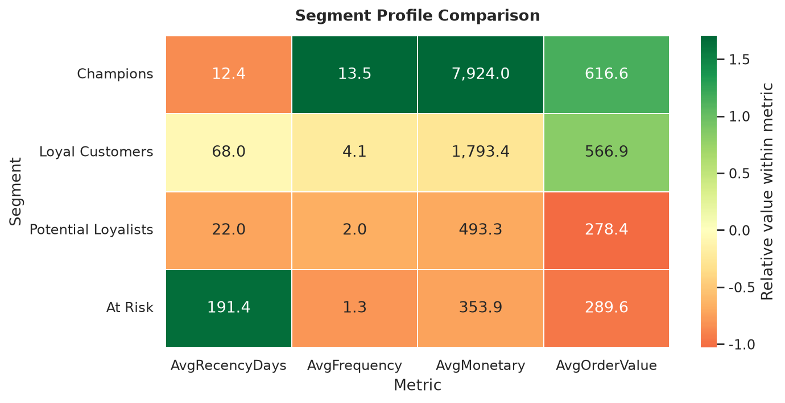

# E-commerce Customer Segmentation Analysis

> An end-to-end **RFM and K-Means customer segmentation** project that converts invoice-level e-commerce transactions into actionable customer groups, Excel reporting, and Power BI-ready data assets.

This portfolio project analyses the UCI Online Retail dataset, which records transactions for a UK-based non-store retailer between 1 December 2010 and 9 December 2011.[1] The reusable pipeline cleans invoice-line data, creates **Recency, Frequency, and Monetary (RFM)** features, applies K-Means clustering, and translates anonymous clusters into practical commercial segments.

| Project outcome | Verified result |
| --- | ---: |
| Transaction rows ingested | 541,909 |
| Cleaned completed purchase lines | 392,692 |
| Customers segmented | 4,338 |
| Revenue analysed | £8,887,208.89 |
| Final customer groups | 4 |

## Business objective

The objective is to identify meaningful differences in customer purchasing behaviour so that marketing effort can be prioritised. Instead of treating every customer equally, the analysis identifies **Champions**, **Loyal Customers**, **Potential Loyalists**, and **At Risk** customers. Each segment is supplied with a focused retention, growth, conversion, or reactivation recommendation.

## Analytical workflow

The source workbook contains invoice-level data, including customer identifier, invoice date, quantity, unit price, and country.[1] The pipeline removes transaction rows that cannot represent a completed customer purchase: records with a missing customer identifier, cancellation invoices, zero or negative quantities, zero or negative prices, and exact duplicate rows. Revenue is calculated as `Quantity × UnitPrice`.

Customer-level RFM features are then calculated at an analysis snapshot one day after the most recent purchase. **Recency** is the number of days since the customer's last purchase, **Frequency** is the number of distinct completed invoices, and **Monetary** is total completed-purchase revenue. Additional descriptive features—average order value, units purchased, tenure, and modal country—are retained for dashboarding.

| Stage | Implementation | Output |
| --- | --- | --- |
| Data preparation | Pandas conversion, validation, de-duplication, and exclusion of invalid purchase lines | Clean, completed customer transactions |
| Feature engineering | RFM aggregation plus average order value, tenure, units, and country | Customer-level behavioural table |
| Model selection | K-Means inertia and silhouette diagnostics for `k = 2` through `k = 8` | Elbow-method evidence for four clusters |
| Segmentation | K-Means with standardised `log1p(RFM)` values, `random_state=42`, and 25 initialisations | Stable cluster assignments |
| Business translation | Deterministic RFM-profile rules map clusters to customer-friendly labels | Four prioritised marketing audiences |
| Reporting | CSV extracts, Excel workbook, and Power BI field/DAX guide | Portfolio-ready reporting package |

The implementation uses scikit-learn's `KMeans` estimator with an explicit random state and multiple initialisations for reproducibility.[2]

## Results and recommendations

The selected four-cluster solution differentiates current high-value customers from valuable but less-recent buyers, newer customers with conversion potential, and customers who have become inactive. The values below are generated by the committed pipeline from the UCI source data.

| Segment | Customers | Customer share | Revenue share | Average recency | Average frequency | Average monetary value | Recommended marketing action |
| --- | ---: | ---: | ---: | ---: | ---: | ---: | --- |
| **Champions** | 731 | 16.85% | 65.18% | 12.45 days | 13.53 orders | £7,923.97 | Protect value through VIP access, premium bundles, and referral incentives. |
| **Loyal Customers** | 1,177 | 27.13% | 23.75% | 68.03 days | 4.12 orders | £1,793.44 | Raise lifetime value with loyalty milestones and personalised cross-sell offers. |
| **Potential Loyalists** | 889 | 20.49% | 4.93% | 21.98 days | 1.96 orders | £493.28 | Motivate a second purchase with product discovery and time-bound offers. |
| **At Risk** | 1,541 | 35.52% | 6.14% | 191.42 days | 1.33 orders | £353.92 | Run a win-back sequence with a compelling reactivation offer and feedback request. |

**Champions** account for only 16.85% of customers but generate 65.18% of analysed revenue. They are the priority audience for relationship protection, recognition, and referral activity. **At Risk** customers are the largest group by customer count and have not purchased for an average of 191 days, making them the primary reactivation audience. **Potential Loyalists** are quite recent purchasers but have completed fewer than two orders on average; they are the strongest opportunity for second-purchase conversion.

## Visual evidence

The elbow diagnostic shows the diminishing reduction in within-cluster variance as additional clusters are added. The project specifies four groups to align model output to a clear, actionable marketing operating model, while the silhouette score is also retained in the data outputs for transparent review.



The segment distribution below makes the commercial trade-off visible: Champions combine low recency with dramatically higher monetary value, while At Risk customers are far less recent and generally lower value.



A profile heatmap gives a compact comparative view of the four segment averages. It should be read metric-by-metric; higher recency means a longer period since the last purchase and is therefore an inactivity signal rather than an inherently positive outcome.



## Power BI dashboard handoff

The `data/processed/` directory contains ready-to-import CSV files. The recommended dashboard design is documented in [`reports/POWER_BI_GUIDE.md`](reports/POWER_BI_GUIDE.md), including the star-schema model, measures, visual layout, segment colours, and DAX calculations. Apply [`powerbi/customer_segmentation_theme.json`](powerbi/customer_segmentation_theme.json) in Power BI for the documented visual system.

| File | Power BI purpose |
| --- | --- |
| `customer_segments.csv` | Main customer-level table; use it for KPI cards, segment charts, detail tables, and slicers. |
| `segment_profiles.csv` | Segment summary; use it for profile comparison and recommendation context. |
| `segment_recommendations.csv` | Campaign playbook table for business-user guidance. |
| `model_selection_metrics.csv` | Elbow-method and silhouette diagnostic chart. |
| `cleaning_audit.csv` | Data-quality transparency and methodology page. |

## Excel deliverable

The formatted workbook at [`outputs/customer_segmentation_report.xlsx`](outputs/customer_segmentation_report.xlsx) has seven stakeholder-ready sheets: Executive Summary, Segment Profiles, Recommendations, Customer Segments, Model Selection, Cleaning Audit, and Data Dictionary. It can be shared directly with non-technical stakeholders or used as an alternative Power BI import source.

## Repository structure

```text
ecommerce-customer-segmentation/
├── data/
│   ├── processed/                 # Committed dashboard-ready CSV outputs
│   └── raw/                       # Local UCI source workbook; excluded from Git
├── notebooks/                     # Exploratory-analysis notebook
├── outputs/
│   └── customer_segmentation_report.xlsx
├── powerbi/
│   └── customer_segmentation_theme.json # Optional report theme
├── reports/
│   ├── figures/                   # Elbow, scatter, and segment-profile charts
│   ├── POWER_BI_GUIDE.md
│   └── QA_NOTES.md
├── src/
│   └── segmentation_pipeline.py   # Reproducible end-to-end analysis
├── tests/
│   └── test_pipeline.py
├── requirements.txt
└── README.md
```

## Run it locally

Create a virtual environment, install the dependencies, download the source workbook from the UCI Online Retail dataset page, and save it as `data/raw/Online Retail.xlsx`. The raw workbook is intentionally excluded from version control; the dataset is licensed under CC BY 4.0 and must be attributed when reused.[1]

```bash
git clone https://github.com/<your-github-username>/ecommerce-customer-segmentation.git
cd ecommerce-customer-segmentation

python -m venv .venv
source .venv/bin/activate  # Windows: .venv\Scripts\activate
pip install -r requirements.txt

python src/segmentation_pipeline.py --input "data/raw/Online Retail.xlsx" --project-root .
pytest -q
```

The command regenerates the processed CSV data, three charts, and the Excel report. Automated tests validate cleaning rules, RFM calculations, cluster diagnostics, and the completeness of the committed dashboard outputs.

## Limitations and next steps

This project is a behavioural segmentation exercise rather than a causal measurement of campaign impact. Monetary value is historical revenue, not margin or lifetime value; refunds are excluded as cancellations; and the available source data contains no acquisition channel, campaign exposure, or demographic information. A production version should monitor segment drift, incorporate margin and marketing response data, and test treatments with controlled experiments.

## License and attribution

The repository code is available under the [MIT License](LICENSE). The source dataset is separate from the code and is not committed to this repository. The UCI Online Retail dataset is licensed under **CC BY 4.0**; retain the dataset attribution when downloading, redistributing, or adapting it.[1]

## References

[1]: https://archive.ics.uci.edu/dataset/352/online+retail "UCI Machine Learning Repository — Online Retail"
[2]: https://scikit-learn.org/stable/modules/generated/sklearn.cluster.KMeans.html "scikit-learn API Reference — KMeans"
